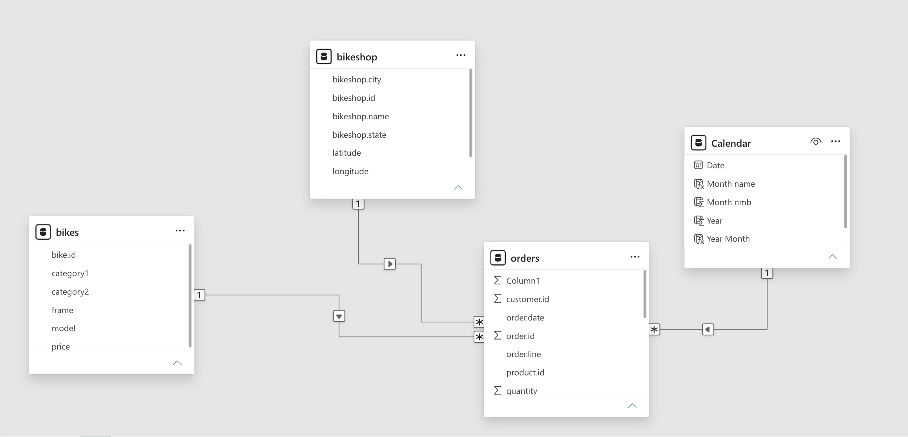
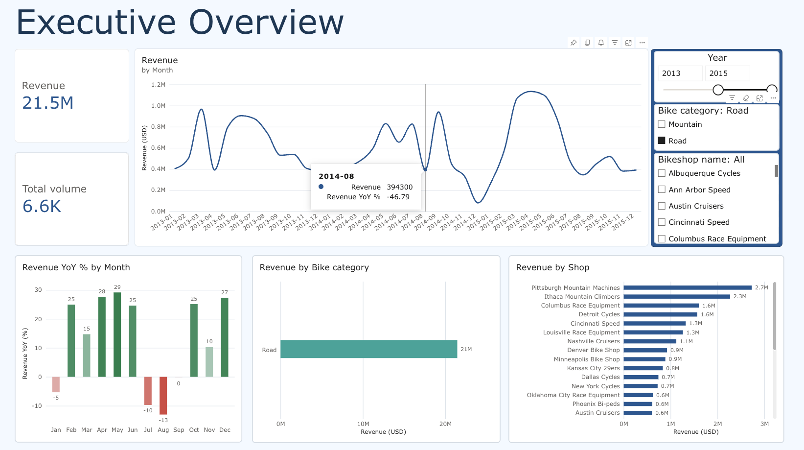
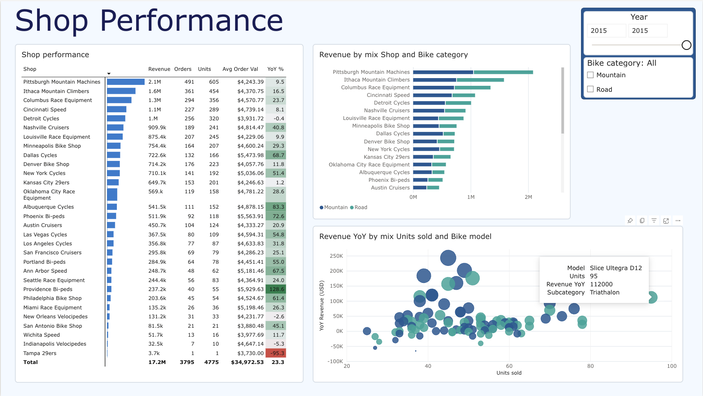
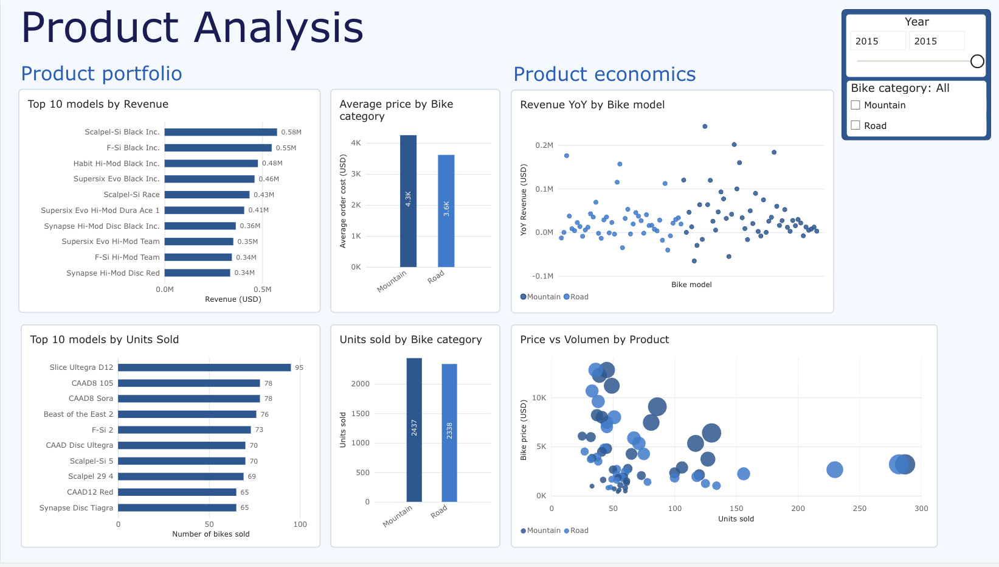

# Power BI Sales & Product Analysis

Power BI portfolio project focused on sales performance, store performance, product mix and revenue drivers.

> **Tool:** Microsoft Power BI  
> **Environment:** Power BI Service (Web)  
> **Author:** Marcin Marzejon

---

## 1. Project Overview

This project analyses bicycle sales data to understand:

- revenue and sales trends over time,
- store-level performance,
- product and category performance,
- the relationship between sales volume and product price,
- year-over-year revenue changes.

The dashboard was designed as a portfolio project to demonstrate practical Power BI and data analysis skills, including data modelling, DAX measures, time intelligence, interactive filtering and dashboard design.

---

## 2. Business Questions

The analysis focuses on the following questions:

1. How does revenue change over time?
2. Is there a seasonal pattern in sales?
3. Which stores generate the most revenue?
4. Which stores show the strongest and weakest YoY performance?
5. Which bike categories and subcategories drive revenue?
6. Which products generate the most revenue and units sold?
7. Does revenue depend more on sales volume, price, or both?

---

## 3. Dataset

**Dataset:** Bike Sales

**Source:** [Kaggle — Bike Sales Dataset](https://www.kaggle.com/datasets/liyingiris90/bike-sales/data)

**Time period:** 2011 - 2015

### Main tables

- `orders` — transactional sales data
- `bikes` — product information, including model, category and price
- `bikeshops` — store information
- `Calendar` — date dimension created for time-based analysis

### Key fields

| Table | Field | Description |
|---|---|---|
| orders | `order.date` | Order date |
| orders | `quantity` | Number of units sold |
| orders | `bike.id` | Product identifier |
| bikes | `bike.id` | Product identifier |
| bikes | `model` | Bike model |
| bikes | `price` | Unit selling price |
| bikes | `category1` | Main product category |
| bikes | `category2` | Product subcategory |
| bikeshops | `bikeshop.name` | Store name |

---

## 4. Data Model

The dataset was modelled using relationships between the transactional and dimension tables.



---

## 5. Key DAX Measures

### Revenue

```DAX
Revenue =
SUMX(
    orders,
    orders[quantity] * RELATED(bikes[price])
)
```

### Revenue LY

```DAX
Revenue LY =
CALCULATE(
    [Revenue],
    SAMEPERIODLASTYEAR('Calendar'[Date])
)
```

### Revenue YoY

```DAX
Revenue YoY =
[Revenue] - [Revenue LY]
```

### Revenue YoY % 

```DAX
Revenue YoY % =
100 * DIVIDE(
    [Revenue] - [Revenue LY],
    [Revenue LY],
    BLANK()
)
```

Returns YoY revenue change in percentage points.

### Average order value

```DAX
AverageOrderValue = AVERAGEX(
    VALUES(orders[order.id]),
    orders[PosTotal]
    )
```

### Displaying revenue in engineering notation

```DAX
DisplayRevenue = 
VAR x = [Revenue]
RETURN
SWITCH(
    TRUE(),
    ABS(x) >= 1000000, FORMAT (x / 1000000, "0.#") & "M",
    ABS(x) >= 1000, FORMAT (x / 1000, "0.#") & "k",
    FORMAT(x, "#,##0")
)
```


---

## 6. Dashboard

The report consists of three main pages.

### 01 — Executive Overview

Focuses on overall business performance.

Key visuals:

- Revenue KPI
- Units Sold KPI
- Revenue trend over time
- Revenue vs previous year
- Revenue by bike category
- Revenue by shop
- Year / Shop / Category filters

**Screenshot:**



---

### 02 — Shop Performance

Focuses on differences between stores.

Key visuals:

- Shop performance table
- Revenue by shop
- Revenue mix by shop and bike category
- Units Sold vs YoY Revenue by shop
- YoY performance

**Screenshot:**



---

### 03 — Product Analysis

Focuses on product and category performance.

Key visuals:

- Top 10 models by revenue
- Top 10 models by units sold
- Revenue vs Category and bike model
- Price vs Units Sold by bike model
- Product-level YoY performance

**Screenshot:**



---

## 7. Key Findings

### Revenue is seasonal and volume-driven

Spring/summer peaks and winter declines indicate a clear seasonal pattern. Revenue growth is strongly linked to units sold.

### Pittsburgh Mountain Machines leads

Pittsburgh Mountain Machines generated $8.9M in revenue in 2015. In 2015, Dallas Cycles recorded the strongest YoY growth, while Tampa 29ers saw the largest decline.

### Mountain Bikes drive revenue

Mountain Bikes generated $39.2M in revenue between  2011 and 2015, with Cross Country Race as the leading subcategory.

### Price matters alongside volume

The Top 10 models by revenue and units sold show limited overlap, indicating that both **sales volume and product price** contribute to revenue performance.

---

## 8. Recommendations

### Focus on high-performing segments

Prioritize _Mountain Bikes_ and the _Cross Country Race_ subcategory in inventory and merchandising planning given their strong revenue contribution.

### Investigate store-level outliers

Review the drivers of _Tampa 29ers'_ decline and _Dallas Cycles'_ performance, focusing on product mix, pricing and inventory.

### Align planning with seasonality

Adjust inventory and promotional planning to capture the spring/summer demand peak and manage the winter slowdown.

---

## 9. Tools & Skills Demonstrated

- **Power BI Service**
- **DAX**
- Data modelling and relationships
- Data preparation
- Time intelligence
- KPI design
- Interactive slicers and filtering
- Conditional formatting
- Scatter plots and comparative analysis
- Top N analysis
- Dashboard UX and visual design
- Business-oriented data storytelling

---

## 10. Limitations & Assumptions

- Revenue is calculated as `quantity × unit price`.
- The analysis focuses on revenue rather than profit because cost and margin data were not available.
- YoY comparisons depend on the availability of corresponding periods in the previous year.
- Product performance should not be interpreted as profitability without cost or margin information.

---

## 11. Potential Next Steps

If additional data were available, the analysis could be extended with:

- gross margin and profitability,
- inventory availability and stock-outs,
- customer segmentation,
- geographic analysis,
- promotional effectiveness,
- customer retention and repeat purchases.

---

## 12. Files

```text
├── README.md
├── LICNESE
│
├── data/
│   ├── bikes.xlsx
│   ├── orders.xlsx
│   └── bikeshops.xlsx
│
├── images/
│   ├── data_model.png
│   ├── executive_overview.png
│   ├── shop_performance.png
│   └── product_analysis.png
│
└── powerbi/
    ├── Bike_Sales_Analysis.pbix
    └── PowerBI_Bike_Sales_Analysis.pdf
```
